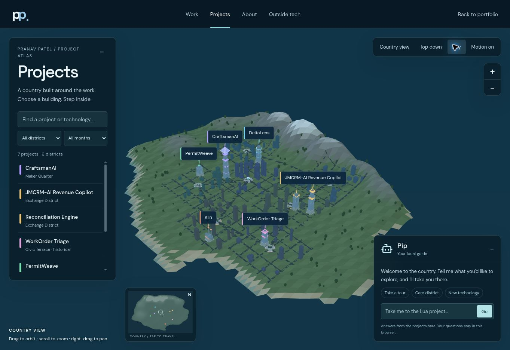

# Projects country release — October 7, 2026

Public page: https://pranav-patel.vercel.app/projects.html

Source: https://github.com/pranavp2418/Oaks_October/tree/main/portfolio-site

Production source commit: `87b1613e300d07b5716cbcd18504e1de88598acb`. Vercel production deployment: `dpl_DJv2aw1ESg7QTtY5vJgocFqrFbea`. Final verified preview: `dpl_2b8N9WBptauXZFdMGhzGZuUD5JpU`. Vercel metadata confirms the source commit and public alias; final logs confirm successful build and deployment.

This separate header page contains an original procedural coastal country, mountain terrain, connected district roads, supporting skyline and forests. Projects occupy stable buildings appropriate to their domain. Seven real catalog entries are shown across six occupied districts: existing flagship/legacy work, the historical dry run, and three completed daily projects. The country itself is a portfolio enhancement, not a new counted daily project.

The page offers orbit, zoom, top-down view, day/night lighting, minimap navigation, directory search/month/district filters, source and walkthrough links, and opt-in real embedded workspaces. Pip answers from the current project catalog, finds projects by technology or purpose, compares them, offers tours and travels along shortest connected roads. It is a local guide; it is not a remote language model and does not transmit or store visitor questions.

## Verification

- Clean `npm ci --ignore-scripts --offline` passed.
- `node --test tests/city-model.test.js`: five tests passed. Coverage includes honest catalog links, Pip purpose/technology matching, Dijkstra versus an independent exhaustive path oracle, 456 unique lots with stable append behavior, and unsafe URL/code-only semantics.
- `npm run build` passed. Vercel's production build passed. The existing shared Three.js bundle produces a 503.57kB chunk warning; no loading-time or frame-rate benchmark is claimed.
- Desktop final preview: rendered terrain, drag orbit, zoom, top-down and day/night views, Lua search, Pip Lua route/camera/arrival, and real Kiln embed passed. Changing the optimizer search budget to one returned the actual feasible/budget-limited certificate.
- Mobile final preview: 390x844 viewport harness fit the full country; body and scroll width were both 390px. Pip's Python healthcare request selected PermitWeave; its project sheet fit the viewport and Step inside opened the actual capacity/audit workspace. This is viewport simulation, not physical-device testing.
- Original portfolio on the same final source: CraftsmanAI Design workflow, CRM walkthrough, archive search for Lua and reset passed. Existing content and daily cards remain. On production, the original archive still shows three daily entries and the Projects header link opens the new country.
- Public production page: seven catalog entries, Pip's Lua request selected Kiln and reached arrival state. Its embedded real app reported `Plan saved · optimal sequence proven · 88 nodes`. Closing the embed restored focus. Public keyboard focus/ArrowLeft and night toggle were usable.
- The screenshot below records the public night view using the software 3D renderer.

## Rendering limits

This browser reports WebGL vendor Disabled. The working Three.js SVGRenderer alternative visibly renders the same real 3D terrain, buildings, camera interaction and Pip navigation. Its reduced tessellation omits physical textures, GPU shadows, reflective water and bloom. Those GPU effects are implemented but could not receive a visual browser check here. Photorealism and performance across devices are not claimed. The country is procedural artwork, not real geographic survey or photogrammetry. Mobile pinch and physical-device performance remain unverified. Some external sites may disallow embedding; new-tab links remain available.

## Future additions

Both presentations consume `portfolio-site/public/projects.json`. Append each verified daily entry once and preserve its slug; the archive and city both receive it. Existing flagship/legacy entries stay in `public/featured-projects.json`. GitHub-only entries retain source and walkthrough actions without fabricated demo links. Stable lot assignment, pagination, capped labels and distant-building detail reduction support collection growth. The durable brief and existing build task now explicitly preserve the country and Pip while continuing the current landing-page addition flow.

No extra paid service, credential, database, domain or plan change was introduced. Deployment protection was preserved; only a temporary preview access link was used for pre-publication checks and it is not included in public source.
