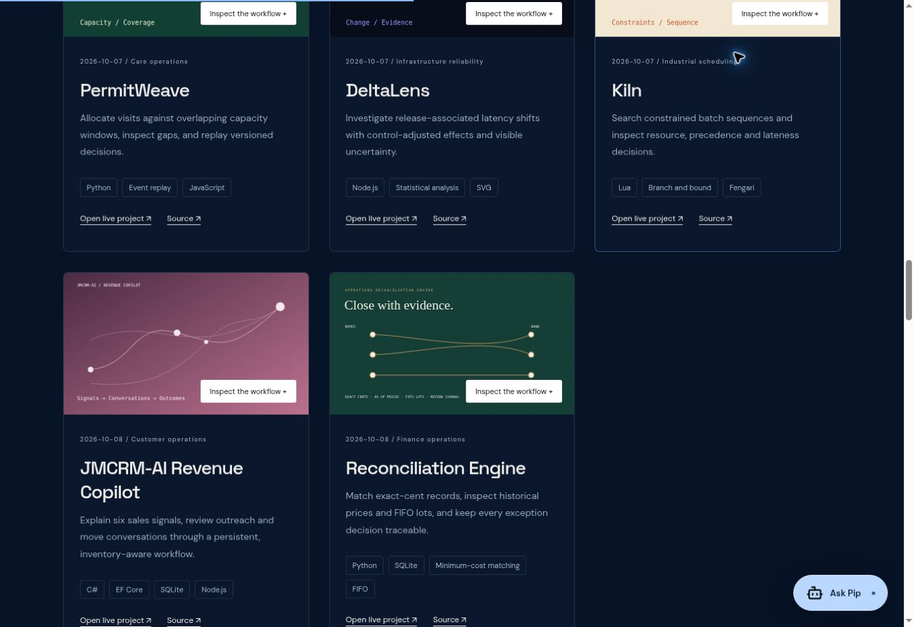
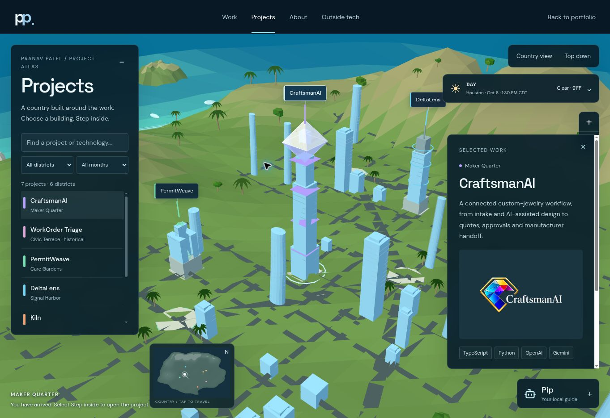

# Completed legacy projects and scoped island release — October 8, 2026

Both legacy entries now have working deployed cores, complete source, locked dependencies, synthetic data, tests and live links. They follow PermitWeave, DeltaLens and Kiln in the existing portfolio archive. These are legacy completions, not new daily projects; existing daily counts and the WorkOrder Triage dry run are unchanged.

| Result | Core | Verification | Source commit | Deployment |
| --- | --- | --- | --- | --- |
| JMCRM-AI Revenue Copilot | Actual compiled C# / EF Core / SQLite, Node HTTP adapter | 7/7 tests; desktop/mobile saved draft/status, refresh, replay, audit and invalid-import preservation | 6d47da0967d852b8e95b45cebd7ae1050b6d5107 | dpl_H7kGPyUZrSmR3AJg4RSQ6EUTYgeb |
| Reconciliation Engine | Python, exact cents, minimum-cost matching, SQLite as-of prices, FIFO | 14/14 tests; 80 small graphs checked against exhaustive matching; desktop/mobile review, pricing, shortage and replay | d7f2e693fb5b41cf4653cf55f937a3ebbd73c3dc | dpl_J9uyab1AobqbdtyWkw5bZEBBRaGZ |
| Portfolio / island | Three.js, physical facade materials, ocean shader and moving shoreline geometry | 15/15 catalog/route/weather/scenery tests; public cards, embeds, Pip, mobile controls and logo | d3bec73404a86a39eae782414f32535d09194446 | dpl_65BYjEa7yWLqCAHUARDEMGnkyxhT |

Live: https://jmcrm-ai-copilot.vercel.app/ and https://reconciliation-engine-pranav.vercel.app/ . Portfolio: https://pranav-patel.vercel.app/ . Island: https://pranav-patel.vercel.app/projects.html . Source folders: Oaks_October/2026-10-08-JMCRM-AI/ and Oaks_October/2026-10-08-Reconciliation-Engine/ in https://github.com/pranavp2418/Oaks_October .

## Commands and observed results

- Both projects: `npm ci --ignore-scripts` passed. JMCRM: `JMCRM_SDK_PATH=<installed-sdk-directory> npm run build`, then `npm test` passed all seven tests of the real executable. The build checks the official SDK SHA512 and publishes a self-contained .NET 10 core. Cloud build logs showed the actual EF Core/SQLite executable being published.
- Reconciliation: `npm run build` and `npm test` passed all 14 tests. HTTP integration exercised the actual Python handler with 200/400/405/409 responses. Cloud build logs showed the Python API being deployed.
- Portfolio: an offline npm cache attempt failed with ENOTCACHED; normal `npm ci --ignore-scripts` recovered. `node --test tests/*.test.js` passed 15/15; `npm run build` passed. The existing 555.27 kB Three.js chunk warning remains. `git diff --check` passed. No throughput, frame-rate or load-time measurements are claimed.

## Browser evidence

JMCRM loaded 54 recommendations across six categories from the native core. A human-edited draft survived refresh and reload. New→Contacted→Replied was saved at revision 4; audit showed all four operations. Refresh created zero new duplicates. Unknown-operation and missing-ID imports returned clear validation messages and preserved revision 4. The latter check exposed and fixed an EF expression-wrapping validation bug.

Reconciliation loaded 14 confirmed pairs; a two-cent tolerance produced 15. A reviewed B016→S021 decision produced 16 and survived reload. Future October 10 pricing was excluded from historical lookups. FIFO showed 31 units/$2,538.50 and I01's 30×R01 + 7×R02 allocation costing $1,571.50; I02 remained quarantined. Mobile assignment persisted at revision 2 without altering inventory. An invalid 31-day-window import was rejected without replacing saved work.

Responsive checks used 390×844 iframe viewports, not physical devices. Both project pages had clientWidth=scrollWidth=375 within the scrollbar-bearing iframe. The mobile island had clientWidth=scrollWidth=390. Top-down, zoom, directory, project selection and the full logo cover passed after software-rendering optimization. Native accessibility calls initially showed toggle buttons as checkboxes; DOM-based scoped controls were used for the final checks.

Public portfolio order was PermitWeave, DeltaLens, Kiln, JMCRM-AI Revenue Copilot, Reconciliation Engine. Full covers and source/live links were verified. Both archive embeds connected to the actual C# and Python cores. Pip navigated to Reconciliation Engine and Step inside opened its live Python workspace. The original CraftsmanAI Design workflow remained functional through keyboard ArrowRight. Public island time/weather displayed the current Houston day/time and observed conditions; clock/weather API tests cover stale and unavailable reports too.

## Island changes and limits

The WebGL implementation now has 2K facade textures, floor/mullion detail, smoother curved profiles, rounded corners, an MSAA offscreen target and outdoor sky reflections. Water uses wind-driven multi-swell displacement, reflection, caustic and shallow-reef effects. Six surf bands move along the actual terrain coastline, and six irregular offshore hills replace square ocean patches. Tides are time-compressed scenery, not a tide forecast. Existing photographic terrain/foliage textures and the scanned coastal tree remain.

The exact attached 1254×1254 CraftsmanAI logo is the island cover, with `object-fit: contain`; its SHA256 is 0297ccb3d5be0ca298026eb25367d313939ac6eeb57fdd8b5ee6859e0a45e591. The homepage CraftsmanAI assets and content are unchanged. The only homepage content movement removes the two old descriptive legacy cards and appends their completed archive cards; the three existing project records are unchanged, and catalog tests preserve existing city lots.

**Visual verification limit:** this browser reports WebGL disabled. Live verification exercised the simplified software renderer; full-detail GPU rendering has not been visually verified. No 8K or photorealistic quality claim is made. The software renderer initially delayed input acknowledgements; reducing its geometry and increasing the processing gap recovered mobile controls while retaining continuous visible motion. High-detail WebGL geometry is retained.

Both project datasets are reproducible synthetic samples (seed 8102026). Work is saved in browser-local journals, with stateless server evaluation, not shared cloud accounts. Embedded and standalone storage may be partitioned by browsers; export/import moves work between contexts. No real customers, financial records, live AI calls, bank integration or production-scale claims are included.

Preview promotion returned Vercel 422. Direct production deployment of the same verified source succeeded; its public alias and exact pushed source SHA were checked. Preview authentication and existing production protection were preserved.

